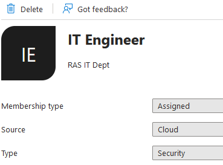

Dynamic Groups with Azure
===

With "RAS Mode" set to "Enable External", Users in Azure AD can be authenticated in APEX *and* have their group memberships recognized as Roles for Authentication Schemes.

The Azure Display Name is used for the registered role in APEX. A variation of this string can be used as the RAS Principal name (`principal_type => 4`)

For the Authorization Scheme, some configuration values need to be adjusted for Azure Social Sign-In when compared to Google Social Sign-In.  (the example values aren't fully vetted)

The "Post-Authentication Procedure" does the work of fetching the infomation from Azure. It enables *all* Groups that the authenticated user belongs to (need to test nested)

Make sure the application is configured for dynamic groups


Example Azure Group


Example Azure User


Example APEX Authorization Scheme


Example of RAS Principal in usage as a modification from the documented RAS HR Demo
```sql
  -- IT_ACL:  This ACL grants IT_ENGINEER role the privilege to view the employee
  --          records in IT department, but it does not grant the VIEW_SALARY
  --          privilege that is required for access to SALARY column.
  aces(1) := xs$ace_type(privilege_list => xs$name_list('select'),
                         principal_name => 'it_engineer',
                         principal_type => 4);
 
  sys.xs_acl.create_acl(name      => 'it_acl',
                    ace_list  => aces,
                    sec_class => 'hr_privileges');
```

Example Post-Authentication Procedure
```sql
procedure post_authentication
as
	l_clob  clob;
    rest_p  apex_application_global.vc_arr2;
    rest_v  apex_application_global.vc_arr2;
begin
    -- set token for REST call
    rest_p(1) := 'Authorization';
    rest_v(1) := trim( apex_json.get_clob('access_token') ); -- bug : you need to trim() the key

    -- make REST Call
    l_clob := apex_web_service.make_rest_request(
          p_url         => 'https://graph.microsoft.com/v1.0/me/memberOf',
          p_http_method => 'GET',
          p_parm_name   => rest_p,
          p_parm_value  => rest_v
        );

    -- parse JSON
    for rec in (select *
                from json_table(l_clob, '$.value[*]'
                    COLUMNS
                        (displayName VARCHAR2(100) PATH '$.displayName'))
                )
    loop
        -- enable Role here
        apex_authorization.enable_dynamic_groups( apex_t_varchar2 ( rec.displayName ) );
        -- bug : RAS External App Roles aren't enabled pre-APEX 22.2.2
        -- bug : RAS Internal App Roles need to be upper(); lower() values aren't recognized
        -- N.B. : External Role names get their spaces replaced with underscore (_) and is upper()
        --      : for RAS Principal. (see v$xs_session_roles )
    end loop;
end;
```